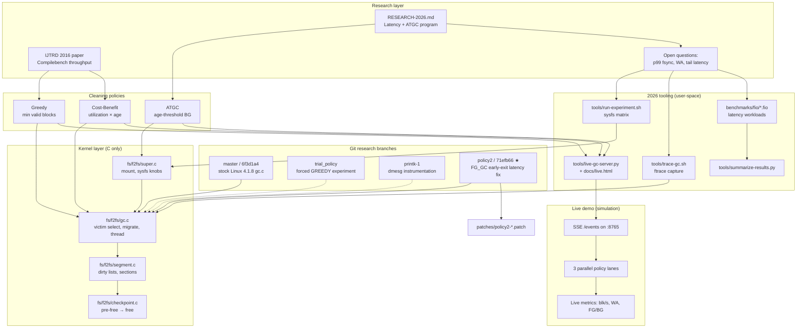
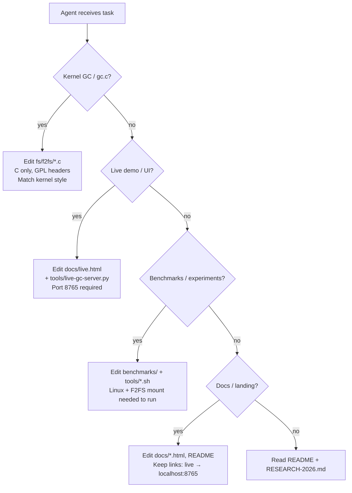

# AGENTS.md — Ad-infinitum Agent Knowledge Graph

> **For AI agents:** Read this file first. It maps what this repo is, how pieces connect, and safe edit boundaries.

## Identity (one sentence)

**Ad-infinitum** is a research repository for **F2FS log-structured filesystem garbage collection** — comparing **Greedy**, **Cost-Benefit**, and **ATGC** cleaning policies — born from a 2016 PICT paper and extended in a **2026 latency-focused program**.

---

## Knowledge graph (concept → artifact)



---

## Entity registry

| Entity | Type | Location | Agent notes |
|--------|------|----------|-------------|
| F2FS GC thread | kernel concept | `fs/f2fs/gc.c` `gc_thread_func()` | Background/foreground trigger logic |
| Victim selection | algorithm | `gc.c` `get_victim_by_default()`, `get_gc_cost()` | Policy via `gc_idle` sysfs on modern kernels |
| Section cleaning | pipeline | wake → victim → scan SIT → migrate → checkpoint → free | Mirrored in live demo stages |
| Greedy | policy | FG default; sysfs `gc_idle=2` | Min valid blocks |
| Cost-Benefit | policy | BG default; sysfs `gc_idle=1` | Util × age from SIT mtime |
| ATGC | policy | sysfs `atgc_enabled=1` | Age-threshold; not in 4.1.8 fork |
| policy2 fix | patch | `origin/policy2`, `patches/policy2-fg-gc-early-exit.reference.patch` | FG_GC early exit per segment |
| Live dashboard | simulation | `docs/live.html` + `tools/live-gc-server.py` | **Not real kernel GC** — educational parallel sim |
| Experiment matrix | config | `benchmarks/experiment-matrix.yaml` | Policy × utilization cells |
| Landing page | static UI | `docs/index.html` | Links to live demo on `:8765` |

---

## Repository map (agent navigation)

```
Ad-infinitum/
├── AGENTS.md              ← you are here
├── README.md              ← human-facing overview + git timeline
├── fs/f2fs/               ← KERNEL: C only, GPL-2.0, Linux 4.1.x snapshot
│   └── gc.c               ← primary research file
├── docs/
│   ├── index.html         ← landing (serve :8080)
│   ├── live.html          ← 3-policy live dashboard (serve via live-gc-server :8765)
│   ├── RESEARCH-2026.md   ← 2026 methodology, sysfs mapping, research questions
│   └── RUNNING-LOCALLY.md ← tiered setup (Windows/Linux/Docker)
├── tools/
│   ├── live-gc-server.py  ← SSE server, simulation-parallel mode
│   ├── run-experiment.sh  ← Linux: sysfs experiment matrix
│   ├── trace-gc.sh        ← Linux: ftrace GC events
│   └── summarize-results.py
├── benchmarks/fio/        ← fio job definitions
├── patches/               ← reference patches (policy2)
├── scripts/               ← verify-local, install-to-kernel
└── docker-compose.yml     ← docs :8080, live profile :8765
```

---

## Git branches (do not confuse)

| Branch | Commit | Use when |
|--------|--------|----------|
| `master` | `6f3d1a4` | Stock 4.1.8 baseline |
| `origin/trial_policy` | `d13f3bb` | Historical GREEDY-only experiment |
| `origin/printk-1` | `f627940` | Historical printk tracing |
| `origin/policy2` | `71efb66` | **Best 2016 deliverable** — latency fix |

Local `master` may contain **uncommitted 2026 reorg** (docs, tools, docker). Check `git status` before assuming clean tree.

---

## Agent task routing



### Common tasks → files

| Task | Edit | Run |
|------|------|-----|
| Change victim scoring in demo | `tools/live-gc-server.py` `pick_victim()` | `python tools/live-gc-server.py` |
| Add live metric | `live-gc-server.py` emit + `docs/live.html` handler | refresh `:8765/live.html` |
| Document sysfs knob | `docs/RESEARCH-2026.md` | — |
| Kernel policy experiment (real) | **Don't patch** — use `tools/run-experiment.sh` on mainline | Linux + F2FS mount |
| Port policy2 to modern kernel | `patches/policy2-*.patch` as reference | compare to `migration_window_granularity` |
| Verify project on Windows | — | `.\scripts\verify-local.ps1` |

---

## Live demo architecture (agents must know)

| Fact | Detail |
|------|--------|
| Mode | `simulation-parallel` — 3 threads, same disk snapshot per round |
| **Not** | Real F2FS kernel module execution |
| Server | `python tools/live-gc-server.py` → **http://localhost:8765/live.html** |
| Wrong URL | Static `python -m http.server 8080` **cannot** run SSE simulation |
| Events | SSE `/events`: `gc_thread_wake`, `victim_select`, `migrate_valid`, `metrics`, `comparison` |
| Policies | `greedy`, `cost-benefit`, `atgc` — parallel each round |

---

## Hard constraints for agents

1. **Kernel code = C only.** No C++ in `fs/f2fs/`. No STL, exceptions, or userspace patterns.
2. **Do not commit** unless the user explicitly asks.
3. **Minimize diff scope** — gc research touches `gc.c`; demo touches `tools/` + `docs/live.html`.
4. **Windows:** F2FS experiments need WSL2/Linux/Docker; live demo works natively with Python.
5. **Preserve GPL-2.0** headers in kernel files.
6. **Live server link:** `docs/index.html` should point to `http://localhost:8765/live.html`, not relative `live.html` on `:8080`.

---

## Quick start commands

```powershell
# Tier 1 — Windows (docs + live demo)
cd "d:\1 - Projects\log-structured\Ad-infinitum"
python -m http.server 8080 --directory docs          # landing
python tools/live-gc-server.py                         # 3-policy dashboard
# Open http://localhost:8765/live.html

# Verify structure
.\scripts\verify-local.ps1
```

```bash
# Tier 3 — Linux real F2FS experiments
sudo ./tools/trace-gc.sh -d /mnt/f2fs -t 60
sudo ./tools/run-experiment.sh -d /mnt/f2fs -p all -u 90 -r 5
python3 tools/summarize-results.py
```

---

## Key code anchors (kernel)

| Function / symbol | File | Role |
|-------------------|------|------|
| `gc_thread_func()` | `gc.c` | BG GC thread loop |
| `select_gc_type()` | `gc.c` | FG→Greedy, BG→CB (stock) |
| `get_gc_cost()` | `gc.c` | Policy-specific victim cost |
| `f2fs_gc()` | `gc.c` | Main GC entry; policy2 adds early exit |
| `get_victim_by_default()` | `gc.c` | Victim segment selection |

---

## Sysfs mapping (2026 experiments on mainline)

| Policy | `gc_idle` | `atgc_enabled` |
|--------|-----------|----------------|
| Greedy | `2` | `0` |
| Cost-Benefit | `1` | `0` |
| ATGC | `1` | `1` |

Path: `/sys/fs/f2fs/<device>/gc_idle`, `atgc_enabled`, etc. See `docs/RESEARCH-2026.md`.

---

## Related documents (read order)

1. `AGENTS.md` (this file) — graph + routing
2. `README.md` — history, branches, build
3. `docs/RESEARCH-2026.md` — 2026 questions + methodology
4. `docs/RUNNING-LOCALLY.md` — environment tiers
5. `docs/live.html` + `tools/live-gc-server.py` — interactive demo implementation

---

## Glossary

| Term | Meaning |
|------|---------|
| **GC** | Garbage collection — reclaiming space in log-structured FS |
| **FG_GC** | Foreground GC — urgent, app-visible latency impact |
| **BG_GC** | Background GC — idle-time cleaning |
| **SIT** | Segment Info Table — valid block counts per segment |
| **Section** | Group of segments cleaned together |
| **Victim** | Segment/section chosen to clean next |
| **WA** | Write amplification — extra writes per user write |
| **ATGC** | Age-Threshold GC — mainline policy (2020+) |

---

*Last aligned with repo: 2026 edition (parallel live demo, fio benchmarks, RESEARCH-2026).*
