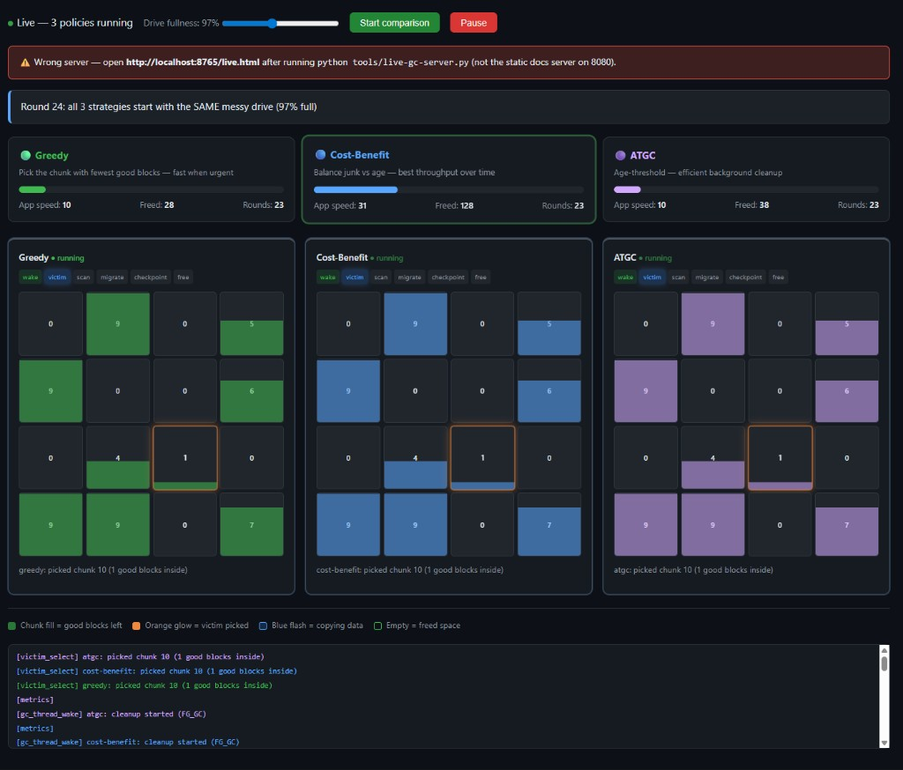
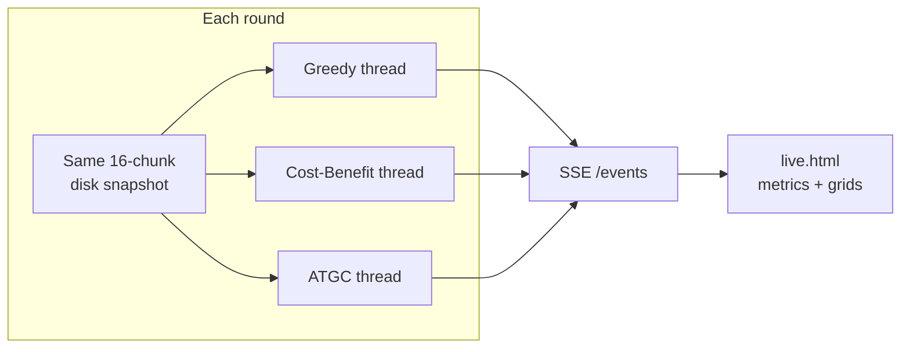
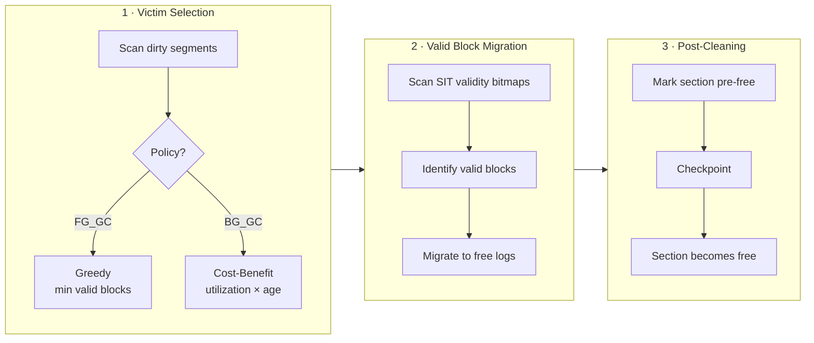
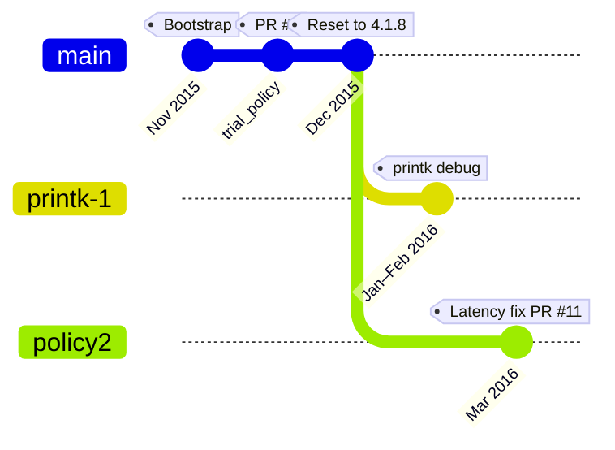

# Ad-infinitum

> **Experimental F2FS kernel module for studying log-structured file system cleaning policies**  
> Companion code repository for academic research at Pune Institute of Computer Technology (PICT), 2015–2016 — **continued in the 2026 edition**.

[](LICENSE)
[](https://www.kernel.org/)
[](https://www.kernel.org/doc/html/latest/filesystems/f2fs.html)
[](https://www.ijtrd.com/papers/IJTRD3508.pdf)
[](docs/RESEARCH-2026.md)
[](docs/index.html)
[](http://localhost:8765/live.html)

> **2026 landing page:** [`docs/index.html`](docs/index.html) — hero visuals, Greedy/CB/ATGC policies, experiment matrix, ftrace replay.  
> **2026 research plan:** [`docs/RESEARCH-2026.md`](docs/RESEARCH-2026.md) — methodology, sysfs mapping, reproducible benchmarks.  
> **Live dashboard:** [`docs/live.html`](docs/live.html) — three cleaning policies racing side-by-side with real-time metrics.

> **Run locally:** see [`docs/RUNNING-LOCALLY.md`](docs/RUNNING-LOCALLY.md) — Docker, Python, or WSL2.  
> **For AI agents:** see [`AGENTS.md`](AGENTS.md) — knowledge graph, file map, and task routing.

---

## Live Policy Dashboard

[](http://localhost:8765/live.html)

**Three policies · one messy drive · live metrics**

*Actual dashboard screenshot — Round 24 at 97% drive fullness, all three policies in FG_GC*

| | |
|---|---|
| **Open live** | [http://localhost:8765/live.html](http://localhost:8765/live.html) |
| **Source** | [`docs/live.html`](docs/live.html) · [`tools/live-gc-server.py`](tools/live-gc-server.py) |

```powershell
# Terminal 1 — landing page (optional)
python -m http.server 8080 --directory docs

# Terminal 2 — live 3-policy simulation (required for SSE)
python tools/live-gc-server.py
# → http://localhost:8765/live.html
```

Each round starts from the **same disk snapshot**. Greedy, Cost-Benefit, and ATGC run **in parallel threads**, pick different victims, and stream metrics over SSE.

### What the dashboard measures

| Metric | What it tells you |
|--------|-------------------|
| **Blocks cleaned** | Total valid blocks reclaimed across all policies |
| **Clean speed** | Blocks freed per second (last completed cycle) |
| **App speed** | Simulated application responsiveness (drops under FG_GC pressure) |
| **Write amplification** | Migrated blocks ÷ freed blocks — migration overhead |
| **FG / BG** | Foreground vs background GC triggers (drive ≥ 88% full → urgent FG_GC) |
| **Sparkline** | Clean-speed history for the last 12 cycles |

### Example session results

Captured from a **live 23-round session** at **97% drive fullness** (foreground GC — see screenshot above):

| Policy | App speed | Blocks freed | Rounds | Notes |
|--------|-----------|--------------|--------|-------|
| **Cost-Benefit** | **31** | **128** | 23 | Best cumulative throughput; highest app speed under sustained pressure |
| **ATGC** | 10 | 38 | 23 | Age-threshold BG efficiency; lags when drive is critically full |
| **Greedy** | 10 | 28 | 23 | Min valid blocks per cycle; all three picked chunk 10 (1 good block) in Round 24 |

At high utilization (≥ 88%), all policies trigger **FG_GC**. Cost-Benefit accumulated the most freed space over 23 rounds while keeping the highest app speed score — Greedy and ATGC converged on the same victim (chunk 10) but freed less total space over time.

Slide **Drive fullness** in the dashboard to compare BG_GC (~72%) vs FG_GC (~95%) behavior side-by-side.



> **Note:** The dashboard is a **Python simulation** for teaching and comparison — not a live kernel trace. For real F2FS data, use [`tools/trace-gc.sh`](tools/trace-gc.sh) on Linux.

---

The 2016 work measured **Compilebench throughput only**. The 2026 program answers the paper's open question: *what about latency, tail behavior, and modern policies?*

| Component | Path | Purpose |
|-----------|------|---------|
| **Live dashboard** | [`tools/live-gc-server.py`](tools/live-gc-server.py) + [`docs/live.html`](docs/live.html) | 3-policy parallel GC simulation with SSE metrics |
| **Experiment runner** | [`tools/run-experiment.sh`](tools/run-experiment.sh) | Policy × utilization matrix via sysfs (no kernel fork) |
| **GC tracing** | [`tools/trace-gc.sh`](tools/trace-gc.sh) | ftrace capture (replaces printk-1 branch) |
| **fio benchmarks** | [`benchmarks/fio/`](benchmarks/fio/) | p99 fsync latency, GC pressure, compile workload |
| **Results analyzer** | [`tools/summarize-results.py`](tools/summarize-results.py) | Parse fio JSON → latency table |
| **Policy2 reference** | [`patches/policy2-fg-gc-early-exit.reference.patch`](patches/policy2-fg-gc-early-exit.reference.patch) | 2016 latency fix for A/B testing |
| **Three policies** | mainline sysfs | Greedy, Cost-Benefit, **ATGC** |

```bash
# Quick start (Linux 5.10+, F2FS mounted at /mnt/f2fs)
sudo ./tools/trace-gc.sh -d /mnt/f2fs -t 60
sudo ./tools/run-experiment.sh -d /mnt/f2fs -p all -u 90 -r 5
python3 tools/summarize-results.py
```

---

## Overview

**Ad-infinitum** is a standalone snapshot of the Linux **F2FS** (Flash-Friendly File System) kernel module, extracted for hands-on experimentation with **segment cleaning** — the garbage-collection mechanism at the heart of every log-structured file system.

Log-structured filesystems append all writes sequentially. Old data is never overwritten in place; instead, space is reclaimed through continuous **background cleaning**. Choosing *which* segments to clean — and *when* — has a direct impact on throughput, write amplification, and application-visible latency. This repository captures the code changes made while investigating those trade-offs.

The work accompanies the survey paper:

> **Survey of Cleaning Policies in Log Structured File Systems**  
> Abhishek Marathe, Prof. Pravin Patil, Akshay Borse, Chetan Satpute, Gopal Heda  
> *International Journal of Trend in Research and Development*, Volume 3(2), Mar–Apr 2016  
> ISSN: 2394-9333  
> [https://www.ijtrd.com/papers/IJTRD3508.pdf](https://www.ijtrd.com/papers/IJTRD3508.pdf)

---

## Research Context

The paper compares cleaning policies across two Linux log-structured filesystems:

| Filesystem | Background cleaning | Foreground cleaning | Notable trait |
|------------|--------------------|--------------------|---------------|
| **NILFS** | Cost-Benefit | Greedy | Continuous snapshotting; B-tree layout |
| **F2FS** | Cost-Benefit | Greedy | Flash-optimized; section/zone hierarchy |

Both rely on two classic victim-selection policies:

| Policy | Strategy | Optimizes for |
|--------|----------|---------------|
| **Greedy** | Pick the section/segment with the **fewest valid blocks** | Low migration cost → lower foreground latency |
| **Cost-Benefit** | Weigh utilization **and** segment age (mtime from SIT) | Throughput; better hot/cold data separation over time |

The paper benchmarks both filesystems using [Compilebench](https://oss.oracle.com/mason/compilebench/) and finds **F2FS consistently outperforms NILFS** on throughput — partly because NILFS snapshot protection complicates live-block accounting and can cause segment starvation.

This repo is where the team **patched F2FS directly** to observe and improve its cleaning behavior.

---

## How F2FS Cleaning Works

F2FS cleans in units of **sections** (groups of segments). The process has three stages:



### On-disk layout (simplified)

```mermaid
block-beta
    columns 3

    block:SB["Superblock (SB)\nFixed parameters"]
    block:CP["Checkpoint (CP)\nRecovery point"]
    block:SIT["Segment Info Table (SIT)\nValid block counts & bitmaps"]

    block:NAT["Node Address Table (NAT)\nNode block locations"]
    block:SSA["Segment Summary (SSA)\nBlock ownership info"]
    block:MAIN["Main Area\nData & node blocks"]

    SB --> CP
    CP --> SIT
    SIT --> NAT
    NAT --> SSA
    SSA --> MAIN
```

Key source files in this repo:

| File | Role in cleaning |
|------|-----------------|
| [`fs/f2fs/gc.c`](fs/f2fs/gc.c) | Garbage collection thread, victim selection, block migration |
| [`fs/f2fs/segment.c`](fs/f2fs/segment.c) / [`segment.h`](fs/f2fs/segment.h) | Segment allocation, dirty lists, cleaning orchestration |
| [`fs/f2fs/checkpoint.c`](fs/f2fs/checkpoint.c) | Checkpoint packs; pre-free → free transition |
| [`fs/f2fs/super.c`](fs/f2fs/super.c) | Mount, sysfs policy knobs, superblock setup |
| [`fs/f2fs/f2fs.h`](fs/f2fs/f2fs.h) | Core data structures and inline helpers |

---

## Project Timeline



| Phase | Dates | Branch | What happened |
|-------|-------|--------|---------------|
| **Bootstrap** | Nov 2015 | `master` | Full F2FS module (~25 files) extracted from Linux 4.1.x |
| **Trial policy** | Nov 2015 | `trial_policy` | Forced GREEDY GC mode; experimental victim-selection changes ([PR #1](https://github.com/amsborse/Ad-infinitum/pull/1)) |
| **Baseline reset** | Dec 2015 | `master` | Restored stock `gc.c` from kernel 4.1.8 |
| **Instrumentation** | Jan–Feb 2016 | `printk-1` | Added `printk` tracing across GC, superblock, checkpoint ([PRs #2–#10](https://github.com/amsborse/Ad-infinitum/pulls)) |
| **Latency optimization** | Mar 2016 | `policy2` | Early-exit foreground GC to reduce long latency ([PR #11](https://github.com/amsborse/Ad-infinitum/pull/11)) |

---

## Branches

The research evolved along **three divergent lines** that were never fully merged:

```
master / origin/master ────── stock gc.c (Linux 4.1.8 baseline)
         │
         ├── origin/trial_policy ── GREEDY-only policy experiment
         │
         ├── origin/printk-1 ────── kernel debug instrumentation
         │
         └── origin/policy2 ─────── ★ recommended: latency optimization
```

| Branch | Tip commit | Description |
|--------|-----------|-------------|
| `master` | `6f3d1a4` | Stock F2FS garbage collector from Linux **4.1.8** |
| `origin/trial_policy` | `d13f3bb` | Alternate GREEDY victim-selection experiment |
| `origin/printk-1` | `f627940` | Verbose `printk(KERN_ERR, …)` logging for runtime observation |
| `origin/policy2` | `71efb66` | **Final deliverable** — foreground GC early-exit latency fix |

To check out the most complete research branch:

```bash
git checkout policy2
# or: git checkout -b policy2 origin/policy2
```

---

## Key Code Changes

### 1 · Trial cleaning policy (`trial_policy`, Nov 2015)

Attempted to override F2FS's adaptive policy selection in `select_gc_type()` and `select_policy()`:

- Hard-coded **`GC_GREEDY`** for all cleaning paths (instead of GREEDY for FG / Cost-Benefit for BG)
- Modified victim cost comparison in `get_victim_by_default()`

> Reverted on `master` in Dec 2015 — the stock dual-policy approach was restored as baseline.

### 2 · Kernel instrumentation (`printk-1`, Jan–Feb 2016)

Added debug logging to observe live GC behavior via `dmesg`:

- GC thread lifecycle (`start_gc_thread`, `gc_thread_func`)
- Policy selection: GREEDY vs Cost-Benefit
- Dirty segment counts before/after victim selection
- Inode dirty flags in `super.c` and `f2fs.h`

Commit messages such as *"update & tested. gc.c is running"* confirm these were validated on a live kernel build.

### 3 · Foreground GC latency fix (`policy2`, Mar 2016) ★

The substantive optimization by **Abhishek Marathe** — changed three functions from `void` to `int` and added early exit in `f2fs_gc()`:

```c
// Before: always process every segment in a section during FG_GC
for (i = 0; i < sbi->segs_per_sec; i++)
    do_garbage_collect(sbi, segno + i, &gc_list, gc_type);

// After: stop once a segment is fully reclaimed
for (i = 0; i < sbi->segs_per_sec; i++) {
    if (!do_garbage_collect(sbi, segno + i, &gc_list, gc_type) && gc_type == FG_GC)
        break;
}
```

**Rationale:** Foreground cleaning is triggered when free sections run low. Processing an entire section when one segment is already empty adds unnecessary latency visible to applications — exactly the kind of metric the paper argues needs attention beyond raw throughput.

---

## Benchmark Results (from the paper)

The survey used **Compilebench** to compare NILFS and F2FS. System time (seconds, lower is better):

| Compilebench phase | NILFS | F2FS |
|--------------------|-------|------|
| Initial create | 1.35 | **1.16** |
| Create | 1.02 | 1.06 |
| Patch | 1.03 | **0.87** |
| Compile | 1.70 | **0.69** |
| Clean | 0.09 | **0.07** |
| Read tree | 1.09 | **0.94** |
| Read compiled | 1.77 | **1.60** |
| Delete tree | 0.52 | **0.49** |
| Delete compiled tree | 0.57 | **0.56** |
| Stat tree | 0.19 | 0.19 |
| Stat compiled tree | 0.23 | **0.22** |

```mermaid
xychart-beta
    title "Compilebench system time — NILFS vs F2FS (lower is better)"
    x-axis ["Init", "Create", "Patch", "Compile", "Clean", "Read", "ReadC", "Del", "DelC"]
    y-axis "Seconds" 0 --> 2.0
    bar [1.35, 1.02, 1.03, 1.70, 0.09, 1.09, 1.77, 0.52, 0.57]
    bar [1.16, 1.06, 0.87, 0.69, 0.07, 0.94, 1.60, 0.49, 0.56]
```



F2FS wins decisively on compile-heavy workloads (Compile: **0.69 s vs 1.70 s**). The paper attributes NILFS's slower performance partly to snapshot-related live-block accounting overhead during cleaning.

---

## Repository Structure

The layout follows standard Linux kernel module conventions — sources live under `fs/f2fs/`, mirroring their in-kernel install path:

```
Ad-infinitum/
├── README.md                 # Project documentation
├── LICENSE                   # GPL-2.0
├── Makefile                  # Out-of-tree build wrapper
├── .editorconfig             # Editor settings (tabs for C, spaces for docs)
├── .gitignore                # Build artifacts, editor cruft
│
├── fs/f2fs/                  # F2FS kernel module sources (drop-in for Linux tree)
│   ├── Makefile              # kbuild module rules (in-tree + out-of-tree)
│   ├── Kconfig               # Kernel configuration options
│   ├── f2fs.h                # Core definitions
│   ├── gc.c / gc.h           # ★ Garbage collection (primary research target)
│   ├── segment.c / segment.h # Segment & section management
│   ├── checkpoint.c          # Checkpoint & recovery
│   ├── super.c               # Mount, sysfs, superblock
│   ├── data.c                # Data block I/O
│   ├── node.c / node.h       # Node (index) management
│   ├── inode.c               # Inode operations
│   ├── dir.c / namei.c       # Directory & path lookup
│   ├── file.c                # File operations
│   ├── recovery.c            # Crash recovery
│   ├── inline.c              # Inline data
│   ├── hash.c                # Directory hashing
│   ├── xattr.c / xattr.h     # Extended attributes
│   ├── acl.c / acl.h         # POSIX ACLs
│   ├── debug.c               # Debugfs statistics
│   └── trace.c / trace.h     # I/O tracing
│
├── docs/
│   ├── index.html            # 2026 interactive landing page
│   ├── live.html             # ★ 3-policy live GC dashboard
│   ├── RESEARCH-2026.md      # Methodology & research questions
│   ├── RUNNING-LOCALLY.md    # Windows / Linux / Docker setup
│   └── assets/
│       ├── hero-2026.png     # Landing page hero
│       └── live-dashboard.png # README screenshot
│
├── tools/
│   ├── live-gc-server.py     # SSE server (port 8765)
│   ├── trace-gc.sh           # ftrace GC capture
│   ├── run-experiment.sh     # Full experiment matrix
│   └── summarize-results.py  # fio JSON → latency table
│
├── benchmarks/
│   ├── fio/                  # fio job files (latency, GC pressure, compile)
│   ├── experiment-matrix.yaml
│   └── results/              # JSON output from run-experiment.sh
│
├── AGENTS.md                 # AI agent knowledge graph
│
├── patches/
│   └── policy2-fg-gc-early-exit.reference.patch
│
└── scripts/
    └── install-to-kernel.sh  # Copy fs/f2fs/ into a Linux source tree
```

---

## Building

### Option A — Out-of-tree (quick build against running kernel)

Requires kernel headers for your running kernel (`/lib/modules/$(uname -r)/build`):

```bash
make                  # produces fs/f2fs/f2fs.ko
sudo make install     # install module + run depmod
sudo modprobe f2fs
sudo mount -t f2fs /dev/sdXn /mnt/f2fs
```

Build against a specific kernel tree:

```bash
make KERNEL_SRC=/path/to/linux-4.1.8
```

### Option B — In-tree (integrate into Linux 4.1.x source)

```bash
./scripts/install-to-kernel.sh /path/to/linux-4.1.8
cd /path/to/linux-4.1.8
make menuconfig   # File systems → F2FS filesystem support
make -j$(nproc)
sudo make modules_install
```

Enable in kernel config:

```
CONFIG_F2FS_FS=m          # or =y for built-in
CONFIG_F2FS_STAT_FS=y     # optional: debugfs stats
CONFIG_F2FS_IO_TRACE=y    # optional: I/O tracing
```

### Observe GC activity (on the `printk-1` branch)

```bash
dmesg -w | grep -E "Policy|Garbage|Dirty segments"
```

> **Note:** These sources target Linux **4.1.8** APIs. Modern kernels have substantially evolved F2FS; direct porting requires API updates.

---

## Contributors

| Name | GitHub / Email | Role |
|------|---------------|------|
| **Abhishek Marathe** | `abhimarathe` | GC latency optimization, testing, instrumentation |
| **Akshay Borse** | `ad-infinitum-pict` | Repo bootstrap, policy experiments, publication co-author |
| **Prof. Pravin Patil** | — | Faculty advisor (PICT) |
| **Chetan Satpute** | — | Co-author |
| **Gopal Heda** | — | Co-author |

**Institution:** Computer Engineering Department, [Pune Institute of Computer Technology (PICT)](https://pict.edu), Pune, India

---

## Publication Citation

```bibtex
@article{marathe2016survey,
  title   = {Survey of Cleaning Policies in Log Structured File Systems},
  author  = {Marathe, Abhishek and Patil, Pravin and Borse, Akshay
             and Satpute, Chetan and Heda, Gopal},
  journal = {International Journal of Trend in Research and Development},
  volume  = {3},
  number  = {2},
  year    = {2016},
  issn    = {2394-9333},
  url     = {https://www.ijtrd.com/papers/IJTRD3508.pdf}
}
```

**Abstract (summary):** CPU speeds have outpaced disk access for decades, making I/O the bottleneck for more applications. Log-structured file systems address this through append-only writes and segment cleaning, but cleaning policy choice — Greedy vs Cost-Benefit — remains critical. This paper surveys NILFS and F2FS cleaning policies, benchmarks them with Compilebench, identifies limitations (especially NILFS snapshot overhead), and outlines directions for future research.

---

## References

1. Changman Lee, Dongho Sim, Joo-Young Hwang, Sangyeun Cho — *F2FS: A New File System for Flash Storage* ([USENIX FAST '15](https://www.usenix.org/conference/fast15/technical-sessions/presentation/lee))
2. Mendel Rosenblum, John K. Ousterhout — *The Design and Implementation of a Log-Structured File System* (ACM TOCS, 1992)
3. [Compilebench](https://oss.oracle.com/mason/compilebench/) — Filesystem benchmark suite
4. [F2FS kernel documentation](https://www.kernel.org/doc/html/latest/filesystems/f2fs.html)
5. [Survey paper (IJTRD)](https://www.ijtrd.com/papers/IJTRD3508.pdf)

---

## License

This code is derived from the Linux kernel F2FS module (Samsung Electronics, 2012) and is licensed under the **GNU General Public License v2**. See individual source file headers for copyright notices.
